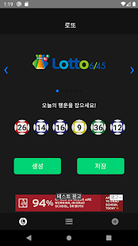
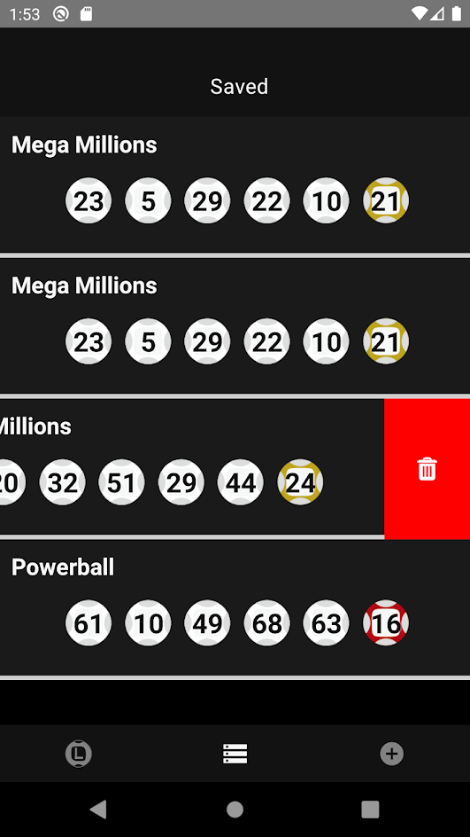

# Lucky Lottery

React Native Lottery Number Generator App with Happy word. Support multi language, Save/Delete Number

# App
you can get App below link. Happy lottering ~!
<p align='left'>
    <a href="https://play.google.com/store/apps/details?id=com.luckylottery">
        <br/>
    </a>
</p>

# Screen Shot 
<p align='center'>
    
    
    
</p>


## Getting Started

1. `git clone https://github.com/hog225/LuckyLotteryP.git`
2. `cd` LuckyLotteryP
3. `npm install` or `yarn install`
4. Run `npx react-native run-android` or `npx react-native run-ios`

## Package Use Tip

### react-navigation
[설치법](https://reactnavigation.org/docs/en/getting-started.html#installing-dependencies-into-an-expo-managed-project) 

### react-native-vector-icons
1. Android Gradle 파일을 수정해 줘야 함 - [방법](https://github.com/oblador/react-native-vector-icons#android)
2. IOS 의 경우 Font를 수동으로 프로젝트에 추가해 줘야 함

### Custom Icon (react-native-custom-icon)

#### Android
0. [여기 참고](https://freakycoder.com/react-native-library-react-native-custom-icon-1ec0b734d691)
1. yarn add react-native-custom-icon
2. IcoMoon 에서 Icon font 화
3. selection.json 파일 import 후 MyIcon component 에 Props로 전달 
4. *.ttf 파일을 Android의 경우 assets/font 에 복사 (폴더가 없을 경우 생성)
#### ios 
1. build Phases 에서 src/assets/fonts/icomoon.ttf 추가 
2. Xcode 로 luckylottery.xproj를 열어서 luckyLottery Info.plist를 연다. 
(react-native-vector-icons 이 링킹이 되어있어야함 React-native 6.x는 신경 X)
3. Fonts provided by application 에 icomoon.ttf 추가 
4. 안될때는 build 폴더 삭제 

## Android Launcher Icon Change
1. Android Studio 에서 RN 프로젝의 android 폴더를 연다. 
2. File > Sync Project with Gradle files 로 Gradle을 업데이트 한다. 
3. app > res (generated 가 없는 것) 우클릭 해서 New > Image Asset 을 Open 한다. 
4. Foreground Layer 탭에서 Name, Layer Name을 변경하고 Path에서 이미지 파일을 가져온다. 
5. Scailing 버튼을 통해 아이콘을 적절하게 맞춘다. 
6. Background Layer 탭에서 Layer Name을 입력한뒤 Source Asset에서 색을 변경한다. 
7. Next를 누르고 Finish 한다.
8. AndroidManifest.xml 파일을 열어서 아래 부분을 수정한다. 
    ```
    android:icon="@mipmap/ic_launcher_XXX"
    android:roundIcon="@mipmap/ic_launcher_XXX_round"
    ```
